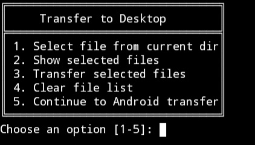

# T.DROP

**A simple Bash script to transfer files between Termux internal storage and Kali Linux running inside Termux.**  
This tool helps you easily move payloads, logs, or any data between the Kali environment and Android storage, saving time and avoiding manual copy-paste or storage complications.

---

## Installation

### 1. Clone the repository

```bash
git clone https://github.com/mhmoudjma/T.DROP.git
```

### 2. Change directory to the project folder

```bash
cd T.DROP
```

### 3. Enable storage access in Termux

Make sure Termux has storage permissions enabled:

```bash
termux-setup-storage
```

### 4. Edit the `start-kali.sh` script

#### 4.1 Open the script for editing:

```bash
nano ~/start-kali.sh
```

#### 4.2 Locate this section:

```bash
## uncomment the following line to mount /sdcard directly to /
#command+=" -b /sdcard"
```

#### 4.3 Replace it with the following lines:

```bash
command+=" -b /sdcard:/host-storage"
command+=" -b /data/data/com.termux/files/home/storage/downloads:/host-downloads"
```

---

### 5. Create necessary folders inside Kali

Make sure these folders exist:

```bash
mkdir -p /host-downloads
mkdir -p /host-storage
```

---

### 6. Path references explained

- `/host-downloads` points to `/storage/emulated/0/Download` on your Android device  
- `/host-storage` points to `/sdcard` on your Android device  

> **Note:**  
> If these paths don’t work, verify your own storage paths and update them accordingly in step 4.3.

---

### 7. Make the transfer script executable

```bash
chmod +x T.DROP.sh
```

---

### 8. Run the script

```bash
bash T.DROP.sh
```
or
```bash
./T.DROP.sh
```
⚠️ **Project Migration Notice**

This project was previously hosted under a different GitHub account. Due to security and privacy reasons, it has been moved here. As a result, the stars and traffic stats (clones/views) have been reset. 

Development will continue as normal in this repository. Thank you for your support!

— mhmoudjma 
